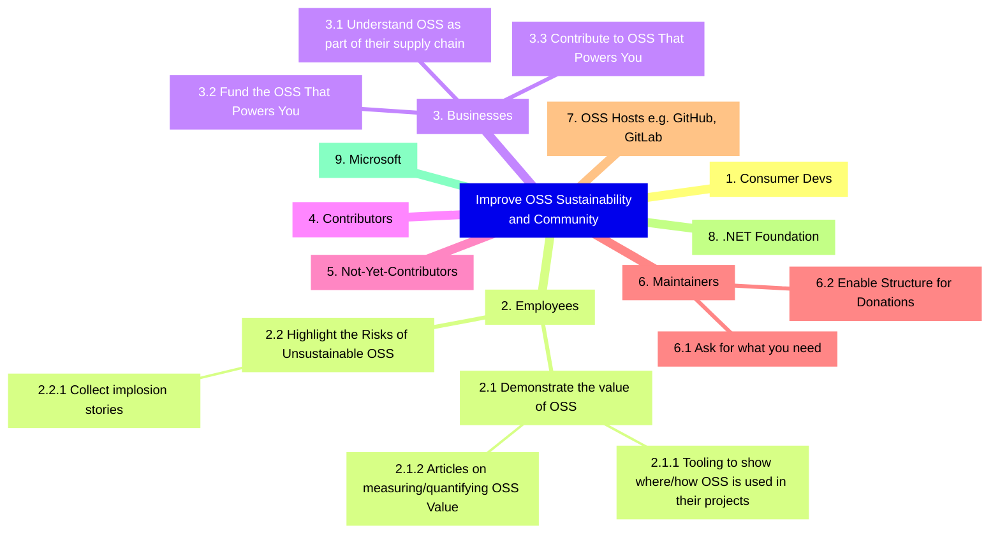

# The Impact Map

## A Quick Introduction

* [Impact Mapping](https://www.impactmapping.org/) is a tool for finding ways to experiment around divergent paths toward a common goal.
* It typically takes the form of a mind map.
  * In the center is a goal
  * The next ring out from that are actors/personas - "who could help us achieve the goal (or hinder it?)"
  * The next ring out from those are behavior chages - "how could that person change their behavior in order to move us toward our goal?"
  * The next ring out from those are influences - "what could we do to influence that actor to make that behavior change?"

We're going to do our best to number the items so that we'll have unique identifiers to use to inform our roadmap.

Contributions Welcome! If you've got something you'd like to add or change on the impact map, it'd be great to start an issue first so that we can discuss how it might best fit in.

ℹ️ We're using [the Mermaid format for mindmaps](https://mermaid.js.org/syntax/mindmap.html) so that we can display it inline in the readme.

## The Current Impact Map

